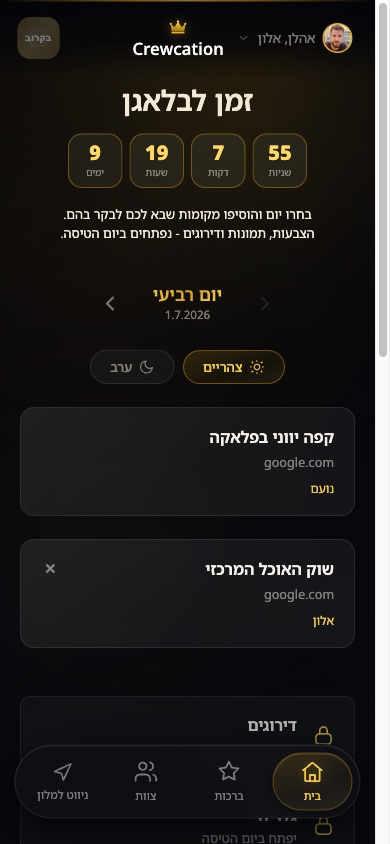
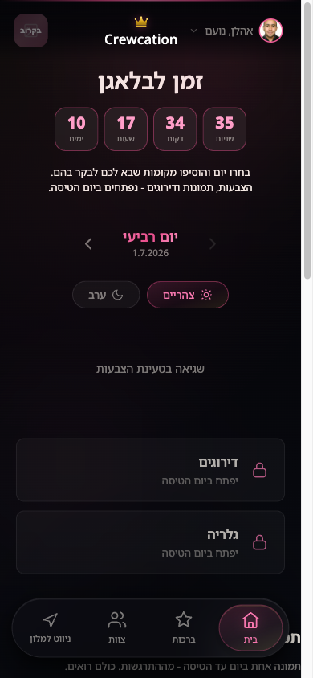
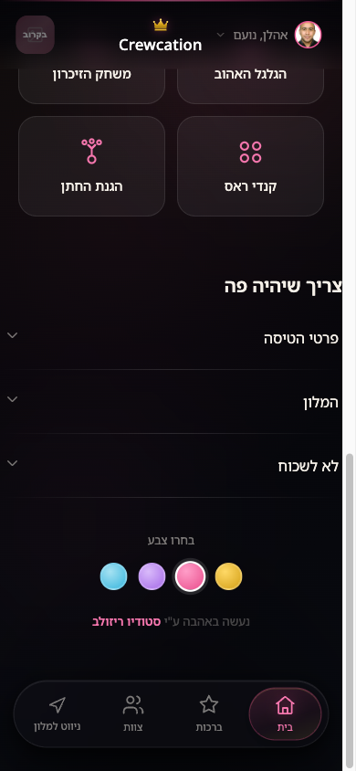

# Crewcation 🧳

**אפליקציית טיול חבר'ה - PWA בעברית (RTL), מובייל-פירסט.**
מתכננים ביחד לאן הולכים, סופרים לאחור לטיסה, מעלים תמונות, משחקים, ובמהלך הטיול
מצביעים, מדרגים ומתעדים. הכל קובץ קונפיג אחד - בלי בסיס נתונים חיצוני, בלי פריימוורק.

> נבנה ע"י **[Resolve Studio](https://resolve.co.il) - סטודיו לעיצוב חווית משתמש (UX/UI)**.
> כל המוצר - מחקר החוויה, העיצוב והקוד - נבנה מפרומפטים בלבד, אפס נגיעה בפיגמה.

### ▶️ [נסה את הדמו החי](https://haparlament.alma-avizmil.co.il/demo/)
שם משתמש: `crew` · סיסמה: `demo` · בחר דמות והיכנס. שחק עם מחליף הצבעים בתחתית הבית.

> **TL;DR (EN):** A mobile-first Hebrew PWA for a group trip / bachelor (or bachelorette) party.
> One app that evolves through the trip: countdown & planning before, live experience during,
> photo album & ratings after. Pure PHP + SQLite, no framework. Configure one file and deploy
> on any PHP host. MIT licensed.

---

## צילומים

| בית (זהב) | החלפת צבע (ורוד) | מחליף הצבעים + קרדיט |
|:---:|:---:|:---:|
|  |  |  |

> **מחליף צבעים חי** - 4 פלטות (זהב / ורוד / סגול / תכלת), כל אחת בדארק מוד, משנה את כל
> המוצר בלחיצה. ורוד למסיבת רווקות, למשל.

---

## הסיפור

לקחתי טיול מסיבת רווקים של חבר לחו"ל, ובניתי לנו גימיק קטן: אפליקציה שגם תתכנן לנו את
הטיול וגם תהיה חלק מהחוויה. **כל המוצר - חוויית המשתמש, העיצוב, הקוד - נבנה מפרומפטים בלבד.
אפס נגיעה בפיגמה.** זו הגרסה הציבורית שלו, מתנה לקהילה - קחו, שנו, השתמשו.

## מה יש בפנים

- **מצב איסוף (לפני הטיסה)** - כל אחד משתף מקומות לכל יום (2 לצהריים, 2 לערב), שעון ספירה
  לאחור לטיסה, "תמונה ביום" (תמונת התרגשות יומית), ורשימת "לא לשכוח" משותפת.
- **מעבר אוטומטי** - ביום הטיסה האפליקציה נפתחת לבד למצב המלא (לפי התאריכים ב-config).
- **מצב חי (במהלך הטיול)** - הצבעות על מקומות, גלריית תמונות, דירוג יומי.
- **כרטיסי שחקן** - לכל אחד פרופיל עם ביו ותגיות שהוא **עורך בעצמו** (עיפרון → הוספה/מחיקה
  עם אנימציות).
- **4 משחקים** עם שיאנים: זיכרון, קנדי-קראש, "הגנת החתן" (משחק הגנה עם נשקים מיוחדים
  מפיקאפים), ו**"הגלגל האהוב"** - גלגל מצחיק שמסובב חבר אקראי ומשפט אקראי ("שתה מים", "מי
  שמדבר על עבודה - שותה"). לפני הטיסה זה סתם גימיק לצחוקים; במהלך הטיול הוא נשאר בתור
  זיכרון נוסטלגי מהימים שלפני.
- **PWA** - מתקינים למסך הבית, עובד כמו אפליקציה.
- **שם האפליקציה משתנה** - "הפרלמנט"? "החבר'ה"? "הנבחרת"? כל אחד בוחר שם בקונפיג.
- **מחליף צבעים** - 4 פלטות בדארק מוד (זהב / ורוד / סגול / תכלת), משנה את כל המוצר בלחיצה.

## הכל ידני - אפס אוטומציה

זה לא מתחבר לשום API ולא מושך כלום מהאינטרנט. **אתם מזינים הכל ביד**, וזה בכוונה - פשוט,
בשליטה מלאה, בלי תלות בשירות חיצוני:

- **לאן טסים / היעד** - מגדירים ב-`HOTEL_URL` (קישור Google Maps) ובקופי שלכם.
- **תמונות המלון/היעד** - שמים ידנית בתיקייה `assets/hotel/`.
- **שעות וזמני הטיסה** - מגדירים ידנית ב-`config.php` (`FLIGHT_TS`, `TRIP_START`).
  השעון לאחור והמעבר האוטומטי בין השלבים מחושבים מהתאריכים האלה.

## 📖 מארגן טיול? יש לך מדריך

**[מדריך המארגן המלא »](docs/ORGANIZER-GUIDE.md)** - הקמה, הגדרות, העלאת תמונות, ואיך
לכתוב את כל הטקסטים בשפה של החבורה שלך - כולל **פרומפט AI מוכן** שכותב לך את כל הקופי
המצחיק לפי הבדיחות הפנימיות של החבר'ה. בלי לדעת לתכנת.

## זה שלכם - קחו ופתחו

זה קוד פתוח ברישיון MIT. **אתם בשליטה מלאה על הקוד** - תעשו fork, תשנו, תוסיפו פיצ'רים,
תחליפו טקסטים, תתאימו לטיול שלכם (לא חייב מסיבת רווקים - כל טיול חבר'ה עובד). אפשר להחליף
משחקים, להוסיף ימים, לשנות עיצוב. זה הפרויקט שלכם מהרגע שהורדתם אותו.

## הקמה

דרישות: שרת עם **PHP 8.1+** (עם הרחבות PDO SQLite + Imagick) - כל אחסון שיתופי מספיק.

```bash
git clone <repo-url> crewcation
cd crewcation
cp config.sample.php config.php   # ערוך: שם אפליקציה, צוות, תאריכים, יעד
```

ערוך את `config.php`:
- `APP_NAME` - שם הקבוצה שלך
- `USERS` - הצוות (שם, סיסמה bcrypt, מי החתן/ה)
- `TRIP_START` / `FLIGHT_TS` / `UNLOCK_TS` - תאריכי הטיול
- `HOTEL_URL` - יעד הניווט

תמונות צוות: שים `assets/members/<id>.jpg` לכל משתמש (ה-id הוא המפתח ב-`USERS`).
התיקיות `data/` ו-`uploads/` צריכות הרשאת כתיבה. בסיס הנתונים נוצר אוטומטית בכניסה הראשונה.

**דמו:** מגיע עם צוות דמו מוכן (5 דמויות, פרצופים אקראיים). סיסמת כל המשתמשים: `demo`,
שם משתמש בכניסה: `crew`.

## אבטחה

כל הנקודות מאחורי התחברות, כל שאילתות ה-SQL מפורמטות (prepared statements), כתיבות מוגבלות
למשתמש המחובר, העלאות חסומות מהרצה, וקבצי `config.php`/DB חסומים מגישה. **חובה לשנות את
סיסמאות הדמו לפני העלאה לאוויר.**

## רישיון

MIT - ראה [LICENSE](LICENSE). נבנה ע"י **[Resolve Studio](https://resolve.co.il)** -
סטודיו לעיצוב חווית משתמש (UX/UI). אהבתם? בואו נעצב גם לכם.
